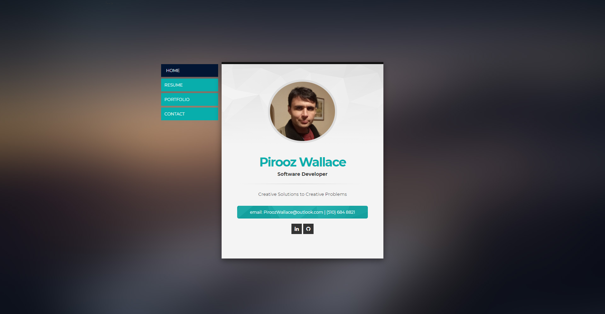
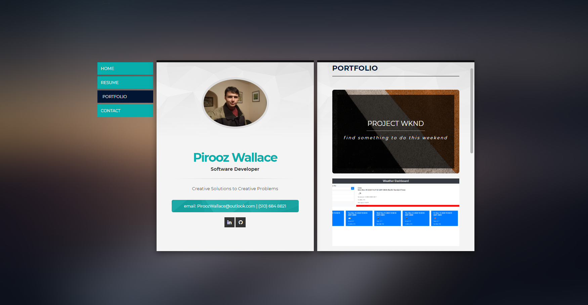
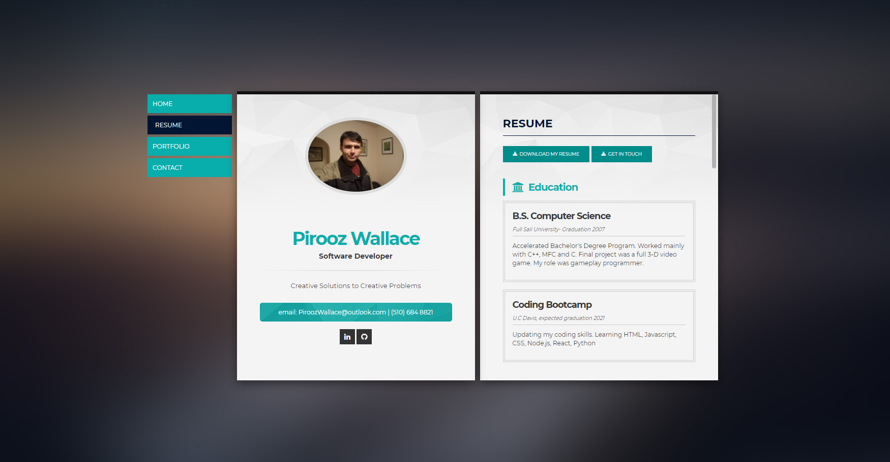
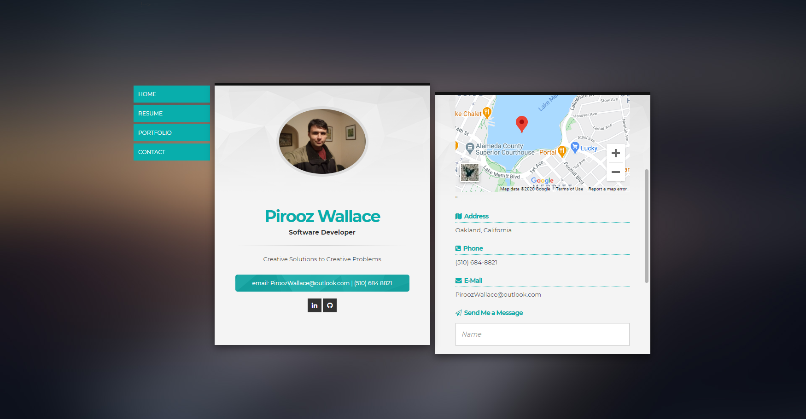

# Portfolio
Pirooz Wallace
11/28/2020

Contact Info: PiroozWallace@outlook.com
LinkedIn : https://www.linkedin.com/in/piroozwallace

Updated Portfolio

GitHub Repo: https://github.com/attack-theoRy/Portfolio

GitHub Pages: https://attack-theory.github.io/Portfolio/

Technologies Used:
- Bootstrap
- JQuery
- Google Maps API
- Nivo Lightbox JS lib
- Owl Carousel CSS
- Font Awesomwe
- Perfect Scrollbar
- PHP for forms
- Template from Envato
- Visual CV

Description:
This is my portfolio / resume site. I used a responsive template from Envato. It has info about myself for potential employers and ways to contact me including links to my GitHub profile and LinkedIn.

There are links to recent projects I've done as well as links to my Github and LinkedIn profile. I added MIT licenses and contact info to all my readmes as well as updated screenshots for some of them.

I created a resume that's also accessible as a downloadable pdf from VisualCV.com. 

I used google maps API to show a map of the general area where I live as well as info to contact me.

MIT License
-----------

Copyright (c) 2020 Pirooz Wallace (https://attack-theory.github.io/Portfolio/)
Permission is hereby granted, free of charge, to any person
obtaining a copy of this software and associated documentation
files (the "Software"), to deal in the Software without
restriction, including without limitation the rights to use,
copy, modify, merge, publish, distribute, sublicense, and/or sell
copies of the Software, and to permit persons to whom the
Software is furnished to do so, subject to the following
conditions:

The above copyright notice and this permission notice shall be
included in all copies or substantial portions of the Software.

THE SOFTWARE IS PROVIDED "AS IS", WITHOUT WARRANTY OF ANY KIND,
EXPRESS OR IMPLIED, INCLUDING BUT NOT LIMITED TO THE WARRANTIES
OF MERCHANTABILITY, FITNESS FOR A PARTICULAR PURPOSE AND
NONINFRINGEMENT. IN NO EVENT SHALL THE AUTHORS OR COPYRIGHT
HOLDERS BE LIABLE FOR ANY CLAIM, DAMAGES OR OTHER LIABILITY,
WHETHER IN AN ACTION OF CONTRACT, TORT OR OTHERWISE, ARISING
FROM, OUT OF OR IN CONNECTION WITH THE SOFTWARE OR THE USE OR
OTHER DEALINGS IN THE SOFTWARE.
		
English Česky
